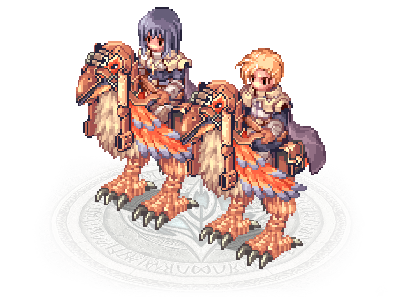

# RO Character Lore Generator



A small AI-powered project that generates Ragnarok Online-style character lore and printable character sheets. This module combines a LangChain-based agent, a vector DB retriever, output parsing, and PDF generation with a lightweight FastAPI web server and a custom Ragnarok Online-themed front-end.

Features
- Generate richly styled character lore (class, alignment, location, backstory).
- Vector DB-based retrieval for lore/context grounding.
- Output parsing and structured JSON -> printable PDF export.
- FastAPI server exposing the agent as HTTP endpoints.
- Custom Ragnarok Online-themed web UI (sprites, parchment styling, pixel fonts).

Project status
- The core LangChain agent, parsing, and PDF generation logic are included.
- A FastAPI server and new web UI are present (feature/RO_character_lore_generator_new-ui).
- Vector DB files are stored in `vector_db/` for local retrieval.

Quick start

1. Clone the repository (root contains multiple agent projects)
   ```bash
   git clone https://github.com/GHBAlbuquerque/ai_agents_collection.git
   cd ai_agents_collection/RO_character_lore_generator
   ```

2. Create and activate a virtual environment
   ```bash
   python -m venv .venv
   source .venv/bin/activate   # macOS / Linux
   .venv\Scripts\activate      # Windows (PowerShell)
   ```

3. Install dependencies
   - This project uses a `pyproject.toml`. Install with pip or poetry:
   ```bash
   # If using pip and a requirements file is available:
   pip install -r requirements.txt

   # OR using poetry (if you prefer):
   poetry install
   ```

4. Configure environment variables
   Create a `.env` file in the project directory (or export env vars). Common variables used:
   ```
   OPENAI_API_KEY=your_openai_api_key
   VECTOR_DB_PATH=./vector_db         # path to local vector DB files
   HOST=127.0.0.1
   PORT=8000
   ```

5. Start the server
   The repository includes a FastAPI server. Two common ways to run it:
   ```bash
   # If the project provides a main entry
   dotenv run python main.py

   # Or run the FastAPI app directly with uvicorn (if server.py exposes `app`)
   uvicorn server:app --reload --host 0.0.0.0 --port 8000
   ```

6. Open the web UI
   - After starting the server, open:
     http://127.0.0.1:8000/
   - The `web/` folder contains a Ragnarok Online-themed UI (`index.html`, CSS, JS, sprites). The UI interacts with the server endpoints to submit character form data and show generated lore, sprites, and PDF export options.

Usage

- Web UI
  - Fill the character creation form (class, gender, alignment, location, optional prompts).
  - The UI will call the server to generate lore and present results. You can preview sprite updates and download a PDF character sheet when generation completes.

- API (general)
  - The FastAPI server exposes endpoints used by the UI. Typical usage pattern:
    - POST /generate (or similar): send character parameters and receive generated lore and structured metadata.
    - GET /sprites/{class}/{gender}: fetch sprite assets.
    - POST /export/pdf: request a generated PDF character sheet.
  - Note: endpoint names may vary depending on `server.py` implementation — check the server file for exact routes.

Project layout
```
RO_character_lore_generator/
├── agent.py                 # Core LangChain agent logic
├── ingestion.py             # Vector database retriever
├── properties.py            # Classes, alignments, locations, model name
├── ouput_parser.py          # Output parsing logic
├── output_file_generator.py # PDF generation logic
├── server.py                # FastAPI server (exposes functions via HTTP)
├── web/                     # Ragnarok Online Custom Web Interface
│   ├── index.html           # Main RO character creation & lore UI
│   ├── css/
│   │   └── ro-theme.css     # RO window borders, pixel fonts, parchment scrolls
│   ├── js/
│   │   └── app.js           # Handles form submissions, sprite updates & API calls
│   └── assets/              # Sprites (Classes/Genders), fanart, SFX
├── vector_db/               # Existing vector DB files
├── pyproject.toml           # Project metadata & dependencies
└── README.md
```

Development notes
- The agent uses a vector DB for grounding. If you update or rebuild the vector DB, place the files in `vector_db/` and set `VECTOR_DB_PATH` accordingly.
- Output parsing: `ouput_parser.py` transforms the agent's free text into structured fields used for the PDF generator.
- PDF generation: `output_file_generator.py` produces printable character sheets. You can adapt styles and templates there.
- Web assets are static files in `web/`. If you change `index.html` or `app.js`, rebuild or refresh the browser to test.

Testing and debugging
- Run the server in reload mode (uvicorn --reload) to pick up changes quickly.
- Check logs printed to the console for agent or parsing errors.
- If OpenAI calls fail, confirm `OPENAI_API_KEY` is set and network access is available.
- If the UI cannot load sprites or endpoints, verify the server is serving the `web/` directory and the endpoints expected by `web/js/app.js` exist.

Common environment variables (summary)
- OPENAI_API_KEY — required for model calls.
- VECTOR_DB_PATH — path to vector DB files (default: ./vector_db).
- HOST, PORT — host and port for the FastAPI server.

Contributing
- Fork the repository and create feature branches.
- Follow existing code style and include tests for new logic where appropriate.
- If you add or modify API endpoints, update `web/js/app.js` to match the changed routes.

License
- This repository does not include a license file by default. Add a LICENSE file in the repository root if you want to make licensing explicit (MIT, Apache-2.0, etc.).

Troubleshooting hints
- "No API key provided" — verify .env is loaded or env var is exported.
- "Vector DB not found" — set `VECTOR_DB_PATH` to correct folder or regenerate DB.
- Server errors with missing imports — ensure you installed dependencies from `pyproject.toml`.

Acknowledgements
- Ragnarok Online-inspired UI and pixel-art assets are fan works. Respect any original creators' asset licenses if used.

Contact / Support
- Open an issue in this repository with details (steps to reproduce, logs, env vars) if you run into problems.