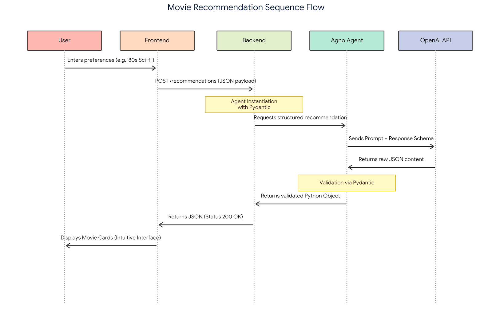
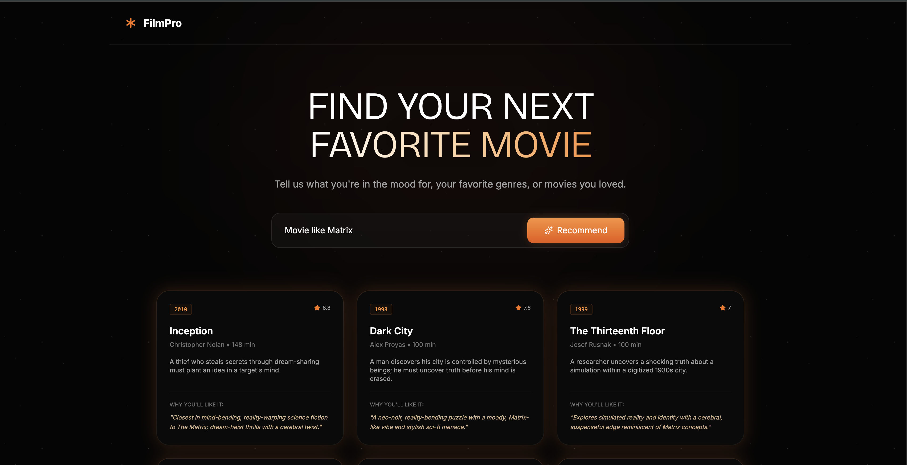

# 🎬 FilmPro: Movie Recommendation Agent

An AI-powered movie curation and recommendation system. FilmPro utilizes an autonomous agent built with **Agno4** to analyze user preferences, search the web via DuckDuckGo, and fetch accurate movie data from the OMDb API to deliver highly personalized movie recommendations.

## 🚀 Architecture & Flow



## 🛠️ Tech Stack

* **Frontend:** HTML, CSS, JavaScript
* **Backend:** FastAPI with Uvicorn server
* **AI Framework:** Agno4
* **LLM:** OpenAI API
* **Tools:** DuckDuckGo (Web Search), OMDb API

## ⚙️ How to Run

1. **Environment Setup:** Make sure you have your `.env` file configured in the project directory with your API keys (e.g., `OPENAI_API_KEY`, OMDb keys).
2. **Start the Server:**
   Navigate to the version folder (v1,v2,v3, v4 or v5) and run:
   ```bash
   dotenv run python main.py
   ```
    OR 
   ```bash
   python main.py
   ```

## 💡 How to Use (Version 4)
Once the server is running, you can interact with the system through an API:

* Get Recommendations:
Send a POST request to:

    ```
    HTTP
    POST [http://0.0.0.0:8000/recommendations](http://0.0.0.0:8000/recommendations)
    ```
    
    _(Passes user preferences to the agent and returns a Pydantic-validated JSON response)._

* Access Project Documentation:

    View the auto-generated Swagger UI docs at:
    http://0.0.0.0:8000/docs
 

## 🖥️ How to use (Version 5)
Version 5 allows interaction through an user interface.
After starting the server:

3. Open v5/site/index.html on a broser
4. Type your movie recommendation desire
5. Read the recommendations on the cards



---
*Project by [@AsimovAcademy](https://github.com/asimov-academy)*

*Developed with ❤️  by [@GHBAlbuquerque](https://github.com/GHBAlbuquerque)*