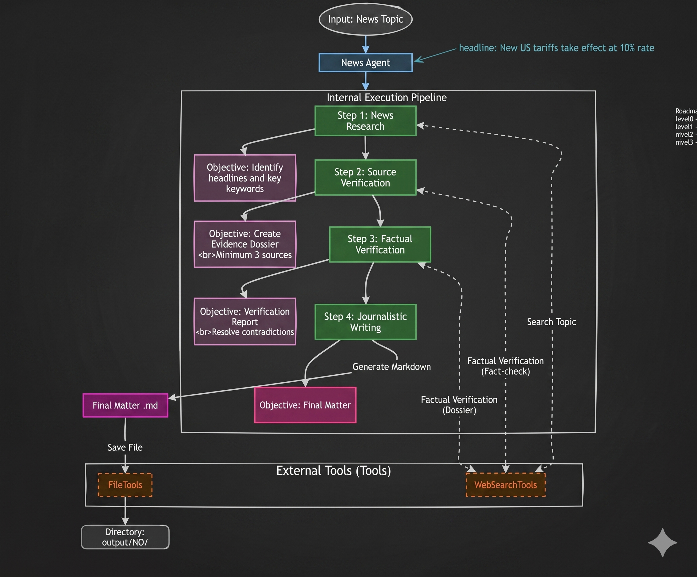

# News Curator

**Level:** 1 (Basic / Introductory)  
**Project:** Asimov Academy

## About the Project

This project involves building an Artificial Intelligence Agent system capable of performing **complete news curation**. You provide a topic, and the system researches the current landscape, cross-references different sources, identifies converging and contradictory information, fact-checks, and finally delivers a structured final journalistic piece with proper references and total traceability.

The project was primarily created as an internal tool for monitoring relevant AI news and is now used to teach the architectural fundamentals of AI Agents in practice.



## Learning Objectives

By the end of developing and following this project, you will have built a valuable repertoire regarding the operational construction of autonomous AI and will understand key concepts of the **Agno** framework:

* **Agent Skills:** How to provide tools (such as file retrieval or web search) that empower your Agent's actions.
* **Multi-Agent Architectures:** The evolution from an individual agent (*standalone* mode) to teams of Agents (*Teams*) and **Workflows**.
* **Automated Investigation:** Strategies and Prompts for cross-referencing real sources.

_Note: As this is a Level 1 project, the focus is on the base architecture and exploring the Agent engine. Complementary features such as Deployment, RAG, and Layout will be covered in subsequent levels (N2/N3)._

## Code Structure

The learning process and code are structured incrementally, represented by scripts `N0` through `N3`:

* `N0 (Monolithic Foundation)`: Focuses on the initial implementation of the curator using a Single Agent architecture to handle all tasks within a single execution flow.

* `N1 (Multi-Agent Transition)`: Begins the architectural shift by decomposing the monolithic structure into a basic Multi-Agent system to separate core responsibilities.

* `N2 (Advanced Orchestration)`: Refines the agent interactions, further segregating the specialized team agents to optimize the workflow between research and content creation.

* `N3 (Specialized Lifecycle)`: The most evolved iteration, implementing a fully modular team where Research, Fact-Checking, and Writing operate as distinct, specialized stages.

* `Skills (Tooling)`: Serves as a centralized repository for isolated tool implementations that are consumed by the agents across the different project levels.

## Tech Stack (Dependencies)

The project relies on the following main libraries found in `pyproject.toml`:

* **[Python](https://python.org/)** (v3.12.11)
* **[Agno](https://github.com/agno-agi/agno)** (v2.4.8) - The base agent framework.
* **OpenAI** - Inference engine (LLM).
* **DuckDuckGo Search (`ddgs`)** - Automated real-time search tool for agents to collect news.
* **FastAPI**

## How to Set Up the Environment

1.  **Initialize the Project**
    ```bash
    uv init --no-git
    ```

2.  **Configure Environment Variables**
    Create a `.env` file in the root directory:
    ```env
    OPENAI_API_KEY="sk-YourKeyHere"
    ```

3.  **Install Dependencies**
    ```bash
    uv sync
    ```

4.  **Run the Modules**
    ```bash
    # Run the modules as desired
    uv run N0_news_curator_agent.py
    uv run N1_news_curator_agent.py
    uv run N2_news_curator_agent.py
    uv run N3_news_curator_agent.py
    ```